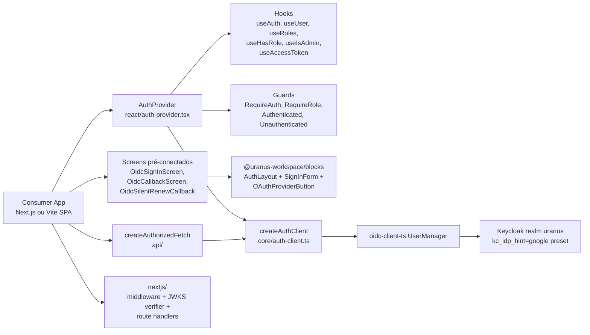

## 1. Posicionamento

Novo pacote publicável em `packages/auth/` chamado `@uranus-workspace/auth`. Não é um app de auth — é a "cola" entre o IdP (Keycloak hoje, qualquer OIDC amanhã) e os blocos visuais já existentes em `@uranus-workspace/blocks`. Reutiliza padrão dos pacotes `ai` e `blocks`: `tsup` ESM+CJS com banner `"use client"`, 5 artefatos por componente (tsx + variants + test + stories + index), MDX em `apps/docs`, stories descobertas por glob no Storybook.

**Compatibilidade alvo (paridade total):**

- **Vite SPA** (React 19 + react-router/tanstack-router/wouter/qualquer outro): caminho default. Importa `@uranus-workspace/auth`, monta `<AuthProvider>`, declara rotas `/callback` e `/silent-renew` no router do consumer. Variáveis via `import.meta.env.VITE_*`. `silent-renew.html` (template) copiado para `public/`.
- **Next.js App Router** (15.x): mesmo provider e hooks rodam no client (`"use client"` no entry principal). Variáveis via `process.env.NEXT_PUBLIC_*`. Pode usar **só** o lado SPA (provider client em layout) ou **opcionalmente** o subpath `/nextjs` para validar tokens no edge/server e proteger Server Components com middleware. `silent-renew.html` no `public/` da app.

## 2. Arquitetura



Decisões-chave:

- **OIDC genérico, Keycloak por preset.** Núcleo nunca importa nada Keycloak-específico. `./keycloak` exporta helpers opcionais: `keycloakSignIn({ idpHint })`, `parseKeycloakRoles(token)` (lê `realm_access.roles` + `resource_access[clientId].roles`), `keycloakLogoutUrl(authority, postLogoutRedirect)`.
- **`oidc-client-ts` como única fonte da verdade** (dependência direta), não `keycloak-js`. PKCE S256 default. `WebStorageStateStore({ store: window.sessionStorage })` sempre — nunca localStorage.
- **`automaticSilentRenew: true`** com URI customizável. Página `/silent-renew.html` é HTML estático que o consumer copia (template em `packages/auth/templates/silent-renew.html`); nosso `<OidcSilentRenewCallback>` é a versão React equivalente quando o app usa rota client-side.
- **Token + role parsing isolados** em `core/token.ts` (decode JWT sem verificar — verificação só no servidor via `jose` + JWKS). Cliente confia na expiração do `oidc-client-ts`.
- **Multiple subpath exports** para evitar puxar peers desnecessários (e.g. `next` só quando usar `/nextjs`, `@uranus-workspace/blocks` só quando usar `/screens`).
- **SSR-safety obrigatória.** Tudo que toca `window`, `sessionStorage`, `location` está atrás de guards (`typeof window !== 'undefined'`) ou só executa em `useEffect`. Isso garante que `<AuthProvider>` montado em um Server Component layout do Next.js não quebre durante o render no servidor — apenas o client toma decisões de auth. `createAuthClient()` é lazy: `UserManager` só é instanciado dentro de `useEffect`.
- **Roteamento agnóstico (sem react-router/next/router como peer).** `<AuthCallback>` aceita `onSuccess(returnTo)` / `onError(err)` e por default chama `window.location.replace(returnTo ?? '/')`. O consumer Next.js troca por `router.replace` do `next/navigation`; o consumer Vite troca por `useNavigate()` do react-router.
- **Env vars detectadas pelo consumer, não pelo pacote.** O pacote só recebe a config já resolvida via props. Os exemplos da doc mostram `import.meta.env.VITE_OIDC_*` para Vite e `process.env.NEXT_PUBLIC_OIDC_*` para Next.js — a leitura é feita no app.

## 3. Estrutura de arquivos

```
packages/auth/
├── package.json
├── README.md
├── tsup.config.ts            # multi-entry: index, core, screens, api, nextjs, keycloak
├── tsconfig.json             # extends @uranus-workspace/tsconfig/react-library.json
├── tsconfig.test.json
├── vitest.config.ts
├── templates/
│   └── silent-renew.html     # template estático para apps copiarem para /public
└── src/
    ├── index.ts                    # main React entry (re-exporta react/* + types públicos)
    ├── core/
    │   ├── index.ts
    │   ├── auth-client.ts          # createAuthClient(config) → wraps UserManager
    │   ├── token.ts                # decodeJwt, isExpired, getRoles
    │   ├── storage.ts              # sessionStorage store factory
    │   ├── types.ts                # AuthStatus, AuthUser, AuthClientConfig, AuthError
    │   └── events.ts               # tipos dos eventos (user-loaded, silent-renew-error, ...)
    ├── react/
    │   ├── index.ts
    │   ├── auth-context.ts
    │   ├── auth-provider.tsx
    │   ├── hooks/
    │   │   ├── use-auth.ts
    │   │   ├── use-user.ts
    │   │   ├── use-roles.ts
    │   │   ├── use-has-role.ts
    │   │   ├── use-is-admin.ts
    │   │   └── use-access-token.ts
    │   └── components/
    │       ├── authenticated.tsx
    │       ├── unauthenticated.tsx
    │       ├── require-auth.tsx
    │       ├── require-role.tsx
    │       ├── auth-callback.tsx
    │       └── silent-renew-callback.tsx
    ├── screens/                    # subpath: @uranus-workspace/auth/screens
    │   ├── index.ts
    │   ├── oidc-sign-in-screen/    # AuthLayout + SignInForm + OAuthProviderButton
    │   │   ├── oidc-sign-in-screen.tsx
    │   │   ├── oidc-sign-in-screen.test.tsx
    │   │   ├── oidc-sign-in-screen.stories.tsx
    │   │   └── index.ts
    │   ├── oidc-callback-screen/   # tela com loader + erro
    │   └── oidc-error-screen/
    ├── api/                        # subpath: @uranus-workspace/auth/api
    │   ├── index.ts
    │   ├── create-authorized-fetch.ts   # wrapper fetch com Bearer + 401 handling
    │   └── create-bearer-interceptor.ts # versão para axios/ky-style libs
    ├── keycloak/                   # subpath: @uranus-workspace/auth/keycloak
    │   ├── index.ts
    │   ├── presets.ts              # signinRedirect helpers ({ idpHint })
    │   ├── roles.ts                # parseKeycloakRoles, hasRealmRole, hasClientRole
    │   └── logout.ts               # keycloakLogoutUrl
    └── nextjs/                     # subpath: @uranus-workspace/auth/nextjs
        ├── index.ts
        ├── server/
        │   ├── verify-token.ts     # JWKS via `jose`, cache de chaves
        │   └── get-session.ts      # cookies → AuthUser
        ├── middleware.ts           # createAuthMiddleware({ publicPaths })
        └── route-handlers/         # opcional: /api/auth/{login,callback,logout}
            ├── login.ts
            ├── callback.ts
            └── logout.ts
```

## 4. API pública (assinaturas-chave)

**`createAuthClient(config)`** — `core/auth-client.ts`

```ts
export interface AuthClientConfig {
  authority: string;            // ex: https://auth.uranus.com.br/realms/uranus
  clientId: string;             // ex: omnifisco-web
  redirectUri: string;
  postLogoutRedirectUri?: string;
  silentRedirectUri?: string;   // /silent-renew.html
  scope?: string;               // default: 'openid email profile'
  automaticSilentRenew?: boolean; // default: true
  storage?: 'session' | 'local' | Storage; // default: 'session'
  extraQueryParams?: Record<string, string>; // ex: { kc_idp_hint: 'google' }
  onSilentRenewError?: (err: Error) => void;
}
```

**`<AuthProvider>`** — aceita `config: AuthClientConfig` ou `client: AuthClient` já criado. No mount: `getUser()` para hidratar sessão, registra eventos `userLoaded | userUnloaded | silentRenewError | accessTokenExpiring | accessTokenExpired`. Estado interno: `{ status: 'loading' | 'authenticated' | 'unauthenticated' | 'error', user, error }`.

**`useAuth()`**: `{ status, user, login, logout, getToken, error }` onde `login(opts?)` aceita `{ idpHint?, returnTo? }` (idpHint é apenas re-export de `extraQueryParams.kc_idp_hint`, mantendo o pacote agnóstico). Antes de chamar `signinRedirect`, salva `returnTo` em `sessionStorage` sob chave estável (`uranus.auth.returnTo`).

**`<AuthCallback>`**: aceita `onSuccess(returnTo)` e `onError(err)` props. Default: `window.location.replace(returnTo ?? '/')`. Não acoplado a router específico — o consumer integra com Next.js Router, React Router, Wouter, etc.

**`<RequireAuth>` / `<RequireRole role="admin">`**: enquanto `loading`, renderiza `fallback?` (default: `null`). Quando `unauthenticated`, chama `login({ returnTo: window.location.pathname })`. Quando role missing, renderiza `forbidden?` (default: `null`).

**`createAuthorizedFetch(getToken, { onUnauthorized })`** — `api/`: wrapper `fetch` que injeta `Authorization: Bearer <token>`; em 401 chama `onUnauthorized` (default: `client.signinRedirect()`).

**`/screens/OidcSignInScreen`** — composição zero-config:

```tsx
<OidcSignInScreen
  brandPanel={<UranusBrand />}
  providers={['google', 'microsoft']}    // botões via OAuthProviderButton
  idpHints={{ google: 'google' }}        // mapeia provider → kc_idp_hint
  credentials="hidden"                    // SSO-only por default
  signUpHref="/sign-up"                   // opcional
/>
```

Internamente: `<AuthLayout>` ([packages/blocks/src/components/auth-layout/auth-layout.tsx](packages/blocks/src/components/auth-layout/auth-layout.tsx)) + `<SignInForm credentials="hidden" socialProviders={...}>` ([packages/blocks/src/components/sign-in-form/sign-in-form.tsx](packages/blocks/src/components/sign-in-form/sign-in-form.tsx)) + `<OAuthProviderButton>` por provider, todos com `onClick={() => login({ idpHint })}`.

**`/nextjs/createAuthMiddleware`**:

```ts
export function createAuthMiddleware(opts: {
  publicPaths: string[];   // ex: ['/login', '/callback', '/health']
  loginPath?: string;      // default: '/login'
  jwksUri: string;         // <authority>/protocol/openid-connect/certs
  audience?: string;       // ex: omnifisco-api (valida `aud`)
}): (req: NextRequest) => Promise<NextResponse>
```

Verifica JWT via `jose.jwtVerify` com `createRemoteJWKSet` (cache automático, rotação de chaves). Sem cookie/expirado → redirect para `loginPath?returnTo=...`.

## 4.1. Integração Vite SPA (default)

`apps/<app>/src/main.tsx`:

```tsx
import { AuthProvider } from '@uranus-workspace/auth';

const config = {
  authority: import.meta.env.VITE_OIDC_AUTHORITY,
  clientId: import.meta.env.VITE_OIDC_CLIENT_ID,
  redirectUri: `${window.location.origin}/callback`,
  silentRedirectUri: `${window.location.origin}/silent-renew.html`,
  postLogoutRedirectUri: window.location.origin,
};

<AuthProvider config={config}>
  <RouterProvider router={router} />
</AuthProvider>
```

Rotas no router do app (react-router exemplo):

```tsx
{ path: '/callback', element: <AuthCallback onSuccess={(to) => navigate(to ?? '/', { replace: true })} /> }
{ path: '/login',    element: <OidcSignInScreen providers={['google']} idpHints={{ google: 'google' }} credentials="hidden" /> }
```

`apps/<app>/public/silent-renew.html` é cópia do template do pacote (Vite serve `public/` em raiz).

`.env`:
```
VITE_OIDC_AUTHORITY=https://auth.uranus.com.br/realms/uranus
VITE_OIDC_CLIENT_ID=omnifisco-web
```

## 4.2. Integração Next.js App Router

`apps/<app>/app/providers.tsx` (Client Component):

```tsx
'use client';
import { AuthProvider } from '@uranus-workspace/auth';

export function Providers({ children }: { children: React.ReactNode }) {
  const config = {
    authority: process.env.NEXT_PUBLIC_OIDC_AUTHORITY!,
    clientId: process.env.NEXT_PUBLIC_OIDC_CLIENT_ID!,
    redirectUri: typeof window !== 'undefined' ? `${window.location.origin}/callback` : '',
    silentRedirectUri: typeof window !== 'undefined' ? `${window.location.origin}/silent-renew.html` : '',
  };
  return <AuthProvider config={config}>{children}</AuthProvider>;
}
```

`app/layout.tsx` envolve `{children}` em `<Providers>`.

`app/callback/page.tsx`:
```tsx
'use client';
import { AuthCallback } from '@uranus-workspace/auth';
import { useRouter } from 'next/navigation';

export default function Page() {
  const router = useRouter();
  return <AuthCallback onSuccess={(to) => router.replace(to ?? '/')} />;
}
```

`public/silent-renew.html` — mesmo template do Vite.

`middleware.ts` (opcional, edge runtime):
```ts
import { createAuthMiddleware } from '@uranus-workspace/auth/nextjs';

export default createAuthMiddleware({
  publicPaths: ['/login', '/callback', '/silent-renew.html', '/api/health'],
  loginPath: '/login',
  jwksUri: `${process.env.NEXT_PUBLIC_OIDC_AUTHORITY}/protocol/openid-connect/certs`,
  audience: 'omnifisco-api',
});

export const config = { matcher: ['/((?!_next|favicon.ico).*)'] };
```

`.env.local`:
```
NEXT_PUBLIC_OIDC_AUTHORITY=https://auth.uranus.com.br/realms/uranus
NEXT_PUBLIC_OIDC_CLIENT_ID=omnifisco-web
```

## 5. Dependências

- **dependency**: `oidc-client-ts@^3` (única dep externa do core)
- **dependency** (apenas no `/nextjs`): `jose@^5` (tree-shakeable; `next` é peer)
- **peerDependencies**:
  - `react@^19`, `react-dom@^19`
  - `@uranus-workspace/design-system: workspace:*` (apenas screens)
  - `@uranus-workspace/blocks: workspace:*` (apenas screens, marcar `peerDependenciesMeta.optional` quando consumer não usa screens)
  - `next@^15` (apenas /nextjs, optional)
  - `react-hook-form`, `zod`, `@hookform/resolvers` — herdados via blocks (optional)

## 6. Configuração do tsup multi-entry

```ts
entry: {
  index: 'src/index.ts',
  core: 'src/core/index.ts',
  screens: 'src/screens/index.ts',
  api: 'src/api/index.ts',
  keycloak: 'src/keycloak/index.ts',
  nextjs: 'src/nextjs/index.ts',
}
```

Banner `"use client"` aplicado em `index`, `screens` e arquivos do `react/`. **Não** aplicar em `core/`, `keycloak/` e `nextjs/server/*` (server-safe).

`exports` em `package.json` mapeia cada subpath:

```json
"exports": {
  ".":         { "types": "./dist/index.d.ts",   "import": "./dist/index.js",   "require": "./dist/index.cjs" },
  "./core":    { "types": "./dist/core.d.ts",    "import": "./dist/core.js",    "require": "./dist/core.cjs" },
  "./screens": { "types": "./dist/screens.d.ts", "import": "./dist/screens.js", "require": "./dist/screens.cjs" },
  "./api":     { "types": "./dist/api.d.ts",     "import": "./dist/api.js",     "require": "./dist/api.cjs" },
  "./keycloak":{ "types": "./dist/keycloak.d.ts","import": "./dist/keycloak.js","require": "./dist/keycloak.cjs" },
  "./nextjs":  { "types": "./dist/nextjs.d.ts",  "import": "./dist/nextjs.js",  "require": "./dist/nextjs.cjs" }
}
```

## 7. Documentação (Fumadocs)

Nova seção `apps/docs/content/docs/auth/`:

- `index.mdx` — overview, princípios (OIDC genérico + Keycloak preset), stack
- `getting-started.mdx` — instalação + AuthProvider mínimo
- `vite.mdx` — guia ponta-a-ponta para Vite SPA (router, callback, silent-renew, env)
- `next-js.mdx` — guia ponta-a-ponta para Next.js App Router (Client Provider, middleware, route handlers, env)
- `keycloak.mdx` — Keycloak preset (kc_idp_hint, roles, logout) com endpoints/clients do Omnifisco como exemplo
- `provider.mdx`, `hooks.mdx`, `guards.mdx`, `screens.mdx`, `api-client.mdx`, `silent-renew.mdx`
- `meta.json` com seções `---Configuração---`, `---Integrações---` (vite, next-js, keycloak), `---React---`, `---Screens---`, `---API---`

Inclui "teste rápido" do prompt original como callout, e uma matriz de variáveis de ambiente recomendadas.

## 8. Storybook

- Atualizar [`apps/storybook/.storybook/main.ts`](apps/storybook/.storybook/main.ts) adicionando `'../../../packages/auth/src/**/*.stories.@(ts|tsx|mdx)'` ao array `stories` e o tsconfig do auth no `tsconfigPaths.projects`.
- Atualizar [`apps/storybook/tsconfig.json`](apps/storybook/tsconfig.json) referência se necessário (o `vite-tsconfig-paths` cuida da resolução em runtime).
- Stories cobertas: `OidcSignInScreen` (variants: split + brand panel; centered; SSO-only; password+SSO híbrido), `OidcCallbackScreen` (loading, success, error), `OidcErrorScreen`. Cada story usa um `MockAuthProvider` em `screens/.testing/` que faz stub do contexto sem chamar Keycloak real.

## 9. Testes

- Vitest + RTL + jest-axe seguindo padrão do repo.
- `auth-client.test.ts`: valida construção do `UserManager` com sessionStorage, scope default, `kc_idp_hint` repassado em `extraQueryParams`.
- `token.test.ts`: decodifica JWT real do exemplo do prompt, extrai `realm_access.roles`, detecta expirado.
- `auth-provider.test.tsx`: simula `userLoaded` / `userUnloaded` / `silentRenewError` (mock de UserManager) e verifica transições de status.
- `use-roles.test.ts`, `use-has-role.test.tsx`: roles parseadas + admin shortcut.
- `auth-callback.test.tsx`: chama `signinRedirectCallback` mockado e dispara `onSuccess` com `returnTo` salvo em sessionStorage.
- `oidc-sign-in-screen.test.tsx`: renderização + jest-axe + click no botão Google chama `login({ idpHint: 'google' })`.
- `nextjs/verify-token.test.ts`: usa `jose` com JWKS local + token assinado de teste para validar caminho de aceitação/rejeição.

## 10. Wiring no monorepo

- `pnpm-workspace.yaml` já cobre `packages/*` — sem mudança.
- [`package.json`](package.json) script `release`: adicionar `--filter='./packages/auth'` ao final do comando.
- [`renovate.json`](renovate.json): considerar adicionar regra de grupamento para `oidc-client-ts` + `jose` (opcional, baixa prioridade).
- Verificar se [CLAUDE.md](CLAUDE.md) precisa de uma menção no `Repo layout` listando o novo pacote (single line).

## 11. Critérios de aceite

- `pnpm install` instala `oidc-client-ts` e `jose`.
- `pnpm --filter @uranus-workspace/auth build` produz `dist/{index,core,screens,api,keycloak,nextjs}.{js,cjs,d.ts}` com banner `"use client"` apenas onde apropriado.
- `pnpm --filter @uranus-workspace/auth test` passa.
- `pnpm storybook` mostra a árvore "Auth › Screens" com `OidcSignInScreen` clicável.
- `pnpm docs:dev` lista a seção "Auth" no sidebar.
- Importações funcionam do app consumidor:
  ```tsx
  import { AuthProvider, useAuth, RequireAuth } from '@uranus-workspace/auth';
  import { OidcSignInScreen } from '@uranus-workspace/auth/screens';
  import { createAuthorizedFetch } from '@uranus-workspace/auth/api';
  import { createAuthMiddleware } from '@uranus-workspace/auth/nextjs';
  import { keycloakSignIn, parseKeycloakRoles } from '@uranus-workspace/auth/keycloak';
  ```

## 12. O que está fora de escopo (intencionalmente)

- Não move os blocos `sign-in-form`, `sign-up-form`, etc. — eles continuam em `@uranus-workspace/blocks` e o pacote auth os consome via peer.
- Não substitui o sistema de email/senha do `SignInForm` — apenas adiciona pré-wirings para o caminho SSO. Apps que precisam de credenciais continuam usando o block diretamente.
- Não inclui templates Terraform/Keycloak nem CLI — só o lado client-side.
- Não trata refresh tokens persistentes (oidc-client-ts já cuida com silent renew via iframe).
